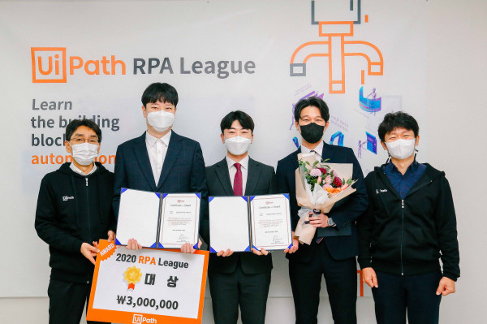

## 구직 서비스 로봇

---

### 🖥️ 프로젝트 소개

- 2020 RPA 해커톤에서 구현한 프로젝트입니다.
- 디지털에 익숙하지 않은 장년층을 위해 대화식으로 구직 서비스를 구현하고자 했습니다.

### 💡 구현 기능

- 음성인식
    - Web, 카카오 음성인식 API → 대화식 서비스 구현
- 일자리 찾기
    - RPA → 일자리 정보 탐색
    - Web, 카카오 맵 API → 일자리 정보 시각화
- 이력서 작성
    - RPA → 사진 촬영, 이력서 자동 작성
- 이력서 제출
    - Web → 앞서 찾은 일자리 정보와 작성한 이력서 화면에 출력
    - RPA → 선택한 회사에 이력서 제출

### 🏆 성과

- 대상 (1등)
- 기사 

[https://www.hankyung.com/society/article/2020121060427](https://www.hankyung.com/society/article/2020121060427)

### 🛠️ 기술 스택

- Spring (Web)
- UiPath (RPA)
- Oracle (DB)

### 🎥 결과 영상

- 일자리 찾기
- 이력서 작성
- 이력서 제출
